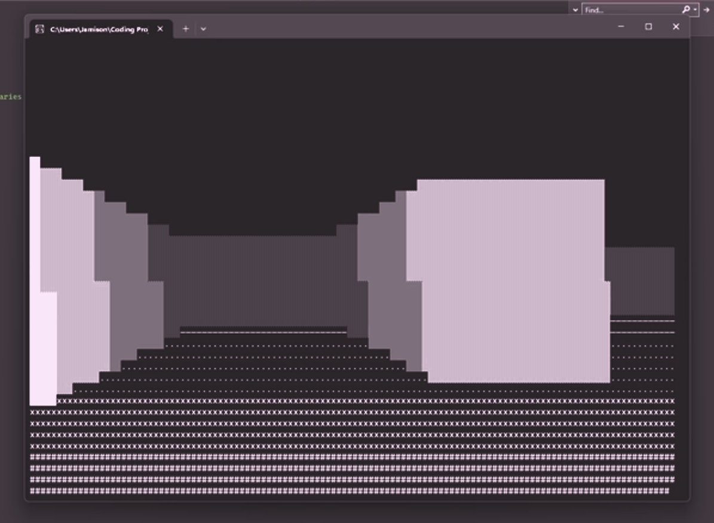

# Console-2.5D-FPS

A CLI based 2.5D renderer using Unicode symbols as graphics.

The 2.5D scene is projected from a 2D map using Porter's Algorithm.

My plan is to eventually add texture mapping and gameplay mechanics.

